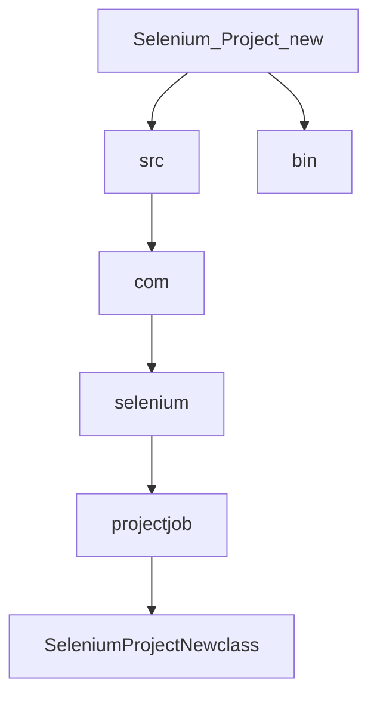

# QATesting
## QA Testing using selenium for interview
### Here we are showing how i use selenium to conduct automated QA testing of a login page using any three inputs 
File strucuture looks like this:

### 
## Here we need to install a few things:
### 1.) Hamcrest
### 2.) JUnit
### 3.) Selenium-Server
### 4.) Chrome driver (*in case we want this to work on chrome driver. here we executed it with firefox.*)
### 5.) JDK

We need to basically attach these libraries to the project and then start coding

## How it works:
We basically have used Selenium because of its reputation for automated testing. We shall soon know and understand the steps for houw it works 

| Step | Procedure |
|-----:|-----------|
| Step 0:| Assign variables on the array for usernames andone variable for password|
| Step 1:| I have used a loop to loop onto the array. The number of times we loop through the array is equal to the size of the array|
| Step 2:| First we get the URL using the driver.get command|
| Step 3:| Then we get the elements such as the login and password entry text boxes|
| Step 4:| We get the element for the submit button|
| Step 5:| We assign variables for the username, password and the submit button with a total of three variables|
| Step 6:| Then we set the username and password inputs onto those variables |
| Step 7:| Then we put the command to conduct the submit option|
| Step 8:| We get to the next page|

### That is how we loop and conduct three Automated QA tests for the website given to me as my [assignment](https://www.saucedemo.com/)
